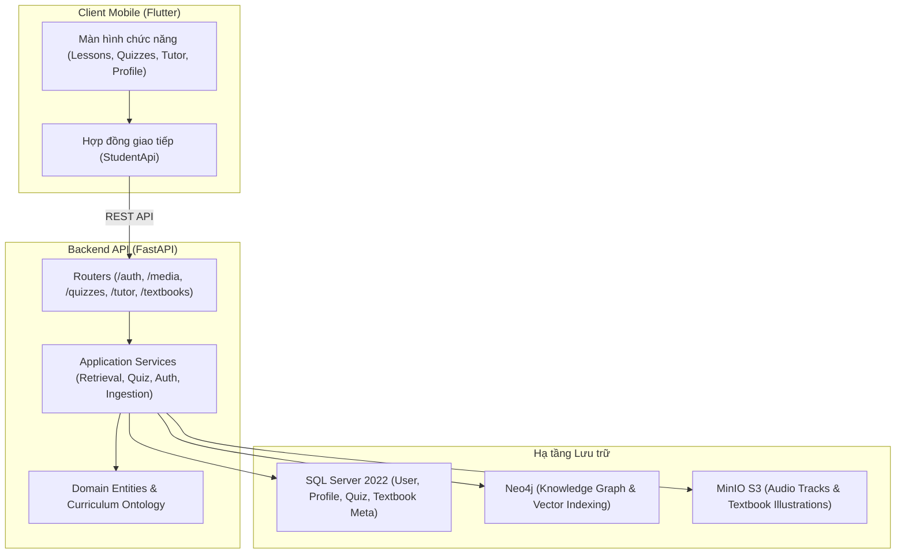

# English 7 Grounded Learning Platform — Tài liệu Thiết kế Hệ thống (DESIGN.md)

> Nền tảng trợ giảng AI sư phạm chuẩn hóa theo chương trình tiếng Anh lớp 7 (*Tiếng Anh 7 – Global Success*).

---

## 1. Triết lý Thiết kế (Design Philosophy)

Hệ thống được thiết kế xoay quanh 3 nguyên tắc cốt lõi:

1. **Grounded Pedagogical Safety (An toàn sư phạm tuyệt đối)**: Mọi câu trả lời của trợ lý AI và bài tập kiểm tra phải bắt buộc trích dẫn bằng chứng thực tế từ sách giáo khoa (`[Unit X, Trang Y]`). Tuyệt đối không sinh nội dung tự do ngoài ngữ cảnh sách học sinh.
2. **Clean Architecture & Separation of Concerns (Kiến trúc sạch)**: Phân tách rõ ràng giữa tầng Domain/Ontology, Application Services, Presentation (FastAPI/Flutter) và Infrastructure (SQL Server, Neo4j, MinIO).
3. **Responsive Multi-modal Learning (Học tập đa phương thức mượt mà)**: Kết hợp học ngữ pháp, từ vựng, phát âm, bài nghe MP3 trực tiếp và bài tập tương tác (bảng phát âm, True/False, nối từ, trắc nghiệm tính giờ).

---

## 2. Design Tokens & Giao diện (Mobile UI Tokens)

Hệ thống áp dụng giao diện màu sắc thân thiện với học sinh trung học cơ sở, phối hợp giữa màu chủ đạo ấm áp và độ tương phản cao để đọc văn bản rõ ràng.

### Bảng màu (Color Tokens)

| Tên Token | Mã Hex | Vai trò trong giao diện |
|---|---|---|
| `Primary Pink` | `#E91E63` / `#F06292` | Màu nhận diện thương hiệu, nút hành động chính, tab đang chọn |
| `Soft Pink Surface` | `#FCE4EC` / `#FFF0F5` | Nền các thẻ bài học, hộp ghi chú phát âm (`guide tips`), viền phụ |
| `Deep Navy / Charcoal` | `#1A1C24` / `#2D3142` | Tiêu đề bài học, chữ chính (đảm bảo chuẩn WCAG độ tương phản cao) |
| `Muted Slate` | `#757575` / `#9E9E9E` | Phụ đề, số trang SGK (`[Unit 1, Trang 9]`), thời gian đếm ngược |
| `Accent Mint` | `#00BFA5` / `#E0F2F1` | Báo đúng (`Correct`), huy hiệu hoàn thành bài học, badge âm tiết |
| `Warning Amber` | `#FFA000` / `#FFF8E1` | Huy hiệu giải thích (`Explanation`), cảnh báo giới hạn lượt nghe |
| `Canvas White` | `#FFFFFF` | Nền ứng dụng chính, card bài học, popup làm bài |

### Bo góc (Border Radius)

- **Thẻ bài học & Context Card**: `12px`
- **Hộp phát âm / Pronunciation Box**: `10px`
- **Nút bấm (Buttons) & Badge**: `8px` - `100px` (Pill shape cho badge "HĐ 1", "HĐ 4")
- **Audio Player Container**: `12px`

### Kiểu chữ (Typography)

- **Font chữ chính**: System Font / Roboto / SF Pro (đồng bộ iOS và Android)
- **Tiêu đề lớn (Headline Large)**: 22px – 24px, Bold (Tiêu đề Unit, tên bài học)
- **Tiêu đề phụ (Title Medium)**: 16px – 18px, Semi-bold (Tên phần Getting Started, A Closer Look)
- **Nội dung (Body Medium)**: 14px – 15px, Regular (Văn bản hội thoại, câu hỏi trắc nghiệm, giải thích)
- **Ký hiệu phiên âm**: Ký tự IPA chuẩn quốc tế (`/ə/`, `/ɜː/`) hiển thị rõ ràng, font size 16px, in đậm.

---

## 3. Kiến trúc Đa tầng (Clean Architecture Baseline)

---

## 4. Mô hình Tri thức & GraphRAG (Knowledge Graph & Retrieval)

### Ontology sư phạm (Pedagogical Ontology)
Tri thức sách giáo khoa được phân rã và liên kết chặt chẽ trong đồ thị Neo4j:
- **`SourceFragment`**: Đoạn trích dẫn SGK cụ thể kèm trang in, số thứ tự hoạt động và nội dung gốc.
- **`Topic`**: Chủ đề bài học (Hobbies, Healthy Living, Music and Arts, v.v.).
- **`GrammarRule`**: Quy tắc ngữ pháp (Hiện tại đơn, So sánh hơn, Động từ tình thái, v.v.).
- **`Vocabulary`**: Từ vựng kèm từ loại (pos), phiên âm IPA và nghĩa tiếng Việt.
- **`PronunciationSound`**: Cặp âm ngữ âm trọng tâm (`/ə/` và `/ɜː/`, `/t/` và `/d/`, v.v.).

### Các mối quan hệ (Relationships)
- `(SourceFragment)-[:TEACHES]->(KnowledgeConcept)`: Đoạn SGK dạy kiến thức.
- `(SourceFragment)-[:EXPLAINS]->(KnowledgeConcept)`: Đoạn trích giải thích quy tắc.
- `(SourceFragment)-[:PRACTICES]->(KnowledgeConcept)`: Bài tập rèn luyện kỹ năng.
- `(GrammarRule)-[:PREREQUISITE_OF]->(GrammarRule)`: Mối quan hệ tiên quyết giữa các điểm ngữ pháp.

### Quy trình Truy xuất Lai (Hybrid Retrieval & RRF)
1. **Vector Query**: Vector hóa câu hỏi học sinh qua `FastEmbed` (`BAAI/bge-small-en-v1.5`, 384 dimensions) và tìm top ứng viên `SourceFragment` và `KnowledgeConcept`.
2. **Graph Traversal**: Mở rộng đồ thị từ các node gốc để tìm các đoạn trích liên quan đa bước (multi-hop) qua các cạnh `TEACHES`, `EXPLAINS`, `PRACTICES`.
3. **Reciprocal Rank Fusion (RRF)**: Hợp nhất điểm số vector và điểm đồ thị theo công thức RRF:
   $$RRF\_Score(d) = \sum_{m \in M} \frac{1}{k + r_m(d)}$$
4. **Context Construction**: Chỉ đưa những đoạn văn bản có điểm số cao và đã xác thực (`verified = true`) vào prompt của LLM để sinh câu trả lời có trích dẫn chuẩn mực.

---

## 5. Mô hình Cơ sở dữ liệu Quan hệ (Relational Schema)

Hệ thống sử dụng Microsoft SQL Server để lưu trữ các thực thể quản trị và nghiệp vụ:
- **`users`**: Tài khoản học sinh (email, password_hash bằng Argon2id, role, trạng thái kích hoạt).
- **`student_profiles`**: Thông tin cá nhân học sinh (họ tên tiếng Việt, ngày sinh, giới tính, tên trường, khối/lớp, tiểu sử).
- **`textbooks` / `units` / `sections` / `activities` / `source_fragments`**: Cây phân cấp sách giáo khoa có đánh số thứ tự và số trang PDF/in thực tế.
- **`quizzes` / `quiz_questions` / `quiz_attempts`**: Bài kiểm tra trắc nghiệm sinh tự động, câu hỏi, điểm số và thời gian nộp bài.
- **`media_assets` / `audio_tracks`**: Ánh xạ giữa mã bài nghe (Track 02, Track 45) và object key lưu trữ trong MinIO.
