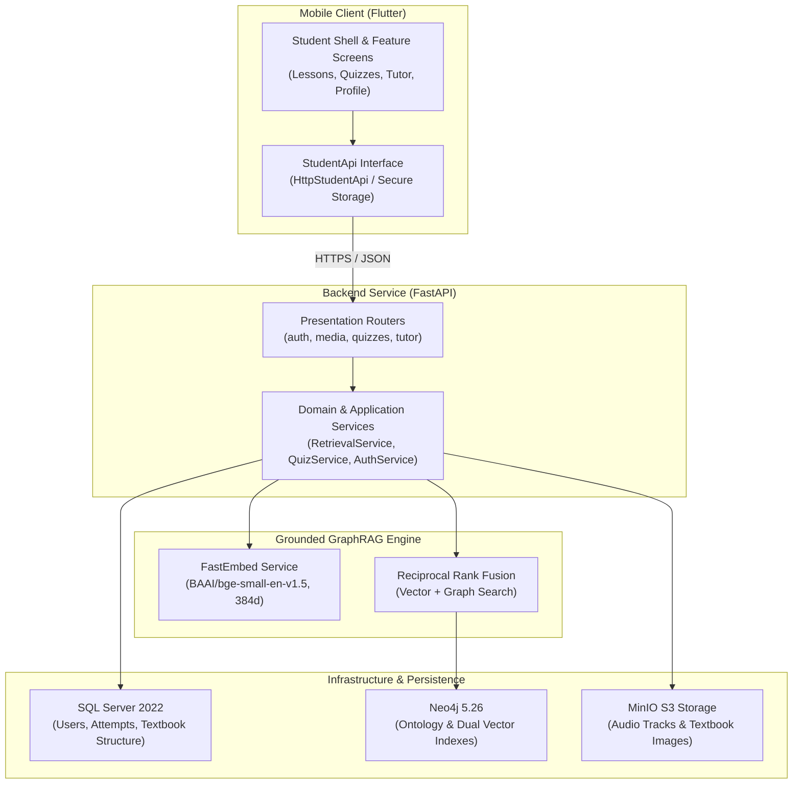

<!--
SPDX-FileCopyrightText: 2026 English 7 Grounded Learning Platform contributors
SPDX-License-Identifier: Apache-2.0
-->

# English 7 Grounded Learning Platform

[](LICENSE)
[](https://www.python.org/)
[](https://flutter.dev/)
[](infra/docker/)

An open-source, API-first pedagogical learning platform grounded exclusively in verified content from the Vietnamese Grade 7 English curriculum (*Tiếng Anh 7 – Global Success* Units 1–12 and Reviews 1–4).

Built for the **Olympic Tin học Sinh viên (OLP) Open Source Competition Standard**, strictly adhering to Clean Architecture, evidence-first retrieval, and comprehensive test coverage.

---

## Architecture Overview



---

## Core Capabilities

1. **Pedagogical GraphRAG & Vector Search**:
   - Dual vector indexing for `SourceFragment` and `KnowledgeConcept` using local FastEmbed (`bge-small-en-v1.5`, 384d).
   - Knowledge ontology entities: `Topic`, `GrammarRule`, `Vocabulary`, and `PronunciationSound`.
   - Weighted multi-hop graph traversal across pedagogical relationships (`TEACHES`, `EXPLAINS`, `PRACTICES`).
   - Grounded citations: every explanation provides unit and page references (`[Unit X, Page Y]`).

2. **Complete Grade 7 Curriculum**:
   - Covers both Semester 1 (Units 1–6 + Reviews 1–2) and Semester 2 (Units 7–12 + Reviews 3–4).
   - Multi-source audio streaming with MinIO S3 storage and local candidate fallback.
   - Interactive exercise activities (pronunciation tables, True/False, matching, gap fills).

3. **Student Profile & Session Security**:
   - Personal profile dashboard (avatar, school, grade, date of birth, bio).
   - Secure Argon2id password hashing and stateless JWT token authentication.
   - Session auto-restore and token persistence via Flutter secure storage.

4. **Timed Quizzes & Evaluation**:
   - Customizable difficulty and duration with audio playback play count enforcement.
   - Instant scoring with answer review.

---

## Standardized Monorepo Structure

```text
.
├── .agents/             # AI agent safety guidelines and quality review checklists
├── .github/             # GitHub Actions CI/CD workflows, PR and issue templates
├── backend/             # Python 3.12 FastAPI backend service, GraphRAG, and tests
├── mobile/              # Flutter mobile student application and widget tests
├── data/                # Curriculum manifests, textbook structure, and metadata
├── evaluation/          # Retrieval-augmented generation evaluation ground truth
├── infra/               # Local Docker topologies, deployment manifests, backups
│   ├── docker/          # Compose files and local service documentation
│   ├── deploy/          # Production deployment candidates
│   └── backups/         # Destination for database recovery dumps (git-ignored)
├── scripts/             # Categorized repository automation scripts
│   ├── audit/           # Secret scans, config checks, compose validation
│   ├── dev/             # Knowledge graph indexing and interactive query tests
│   └── ops/             # Database export, import, backup, and restore routines
├── docs/                # Architecture, API specifications, and operational guides
│   ├── architecture/    # Clean architecture baseline, GraphRAG pipeline, data models
│   ├── superpowers/     # Feature plans, specs, and verification records
│   ├── project-structure.md
│   └── dependencies.md
├── Makefile             # Canonical developer commands and build automation
├── AGENTS.md            # Agent instructions and pedagogical guardrails
├── CHANGELOG.md         # Version history following Keep a Changelog
├── CONTRIBUTING.md      # Contribution workflow and commit conventions
├── CODE_OF_CONDUCT.md   # Contributor Covenant v2.1
├── LICENSE              # Apache-2.0 License
├── SECURITY.md          # Vulnerability disclosure policy
├── .dockerignore        # Container build ignore rules
├── .env.example         # Environment template with dummy placeholders
└── README.md            # Project overview and quickstart
```

For full details, see [`docs/project-structure.md`](docs/project-structure.md).

---

## Developer Quickstart

### Prerequisites

- **Linux / macOS / Windows (WSL2)**
- **Docker & Docker Compose**
- **Python 3.12** with [`uv`](https://github.com/astral-sh/uv)
- **Flutter 3.27+**

### Setup & Launch

1. **Configure Environment:**
   ```bash
   cp .env.example .env
   ```

2. **Start Infrastructure Services:**
   ```bash
   make up
   ```

3. **Run All Tests:**
   ```bash
   make test
   ```

4. **Run Static Analysis & Audits:**
   ```bash
   make analyze
   make audit
   ```

5. **Stop Services:**
   ```bash
   make down
   ```

---

## Makefile Command Reference

| Command | Purpose |
|---|---|
| `make help` | Display available targets and descriptions |
| `make up` | Start Docker containers (SQL Server, Neo4j, MinIO, API, Worker) |
| `make down` | Stop containers cleanly |
| `make logs` | Follow live container logs |
| `make test` | Run all backend (`pytest`) and mobile (`flutter test`) suites |
| `make test-backend` | Run 160+ backend unit and modular pytest cases |
| `make test-mobile` | Run 30+ Flutter widget and unit test cases |
| `make analyze` | Run Flutter static analysis (0 errors, 0 warnings enforced) |
| `make audit` | Audit repository for secrets, hardcoded configs, and compose syntax |
| `make seed` | Seed textbook curriculum and populate Neo4j knowledge graph |
| `make db-backup` | Create database backup dump |
| `make db-restore` | Restore database from latest backup |
| `make clean` | Clean cache directories and build outputs |

---

## Documentation Index

- **Project Architecture**: [`docs/architecture/system-overview.md`](docs/architecture/system-overview.md)
- **Project Structure**: [`docs/project-structure.md`](docs/project-structure.md)
- **Dependencies Inventory**: [`docs/dependencies.md`](docs/dependencies.md)
- **GraphRAG Ideation**: [`docs/architecture/graphrag-ideation.md`](docs/architecture/graphrag-ideation.md)
- **Linux Setup**: [`docs/setup-linux.md`](docs/setup-linux.md)
- **Windows Setup**: [`docs/setup-windows.md`](docs/setup-windows.md)
- **Android Studio Guide**: [`docs/android-studio.md`](docs/android-studio.md)
- **Agent Instructions**: [`AGENTS.md`](AGENTS.md)
- **Review Checklists**: [`.agents/checklists/`](.agents/checklists/)

---

## License

Licensed under the [Apache License, Version 2.0](LICENSE).
