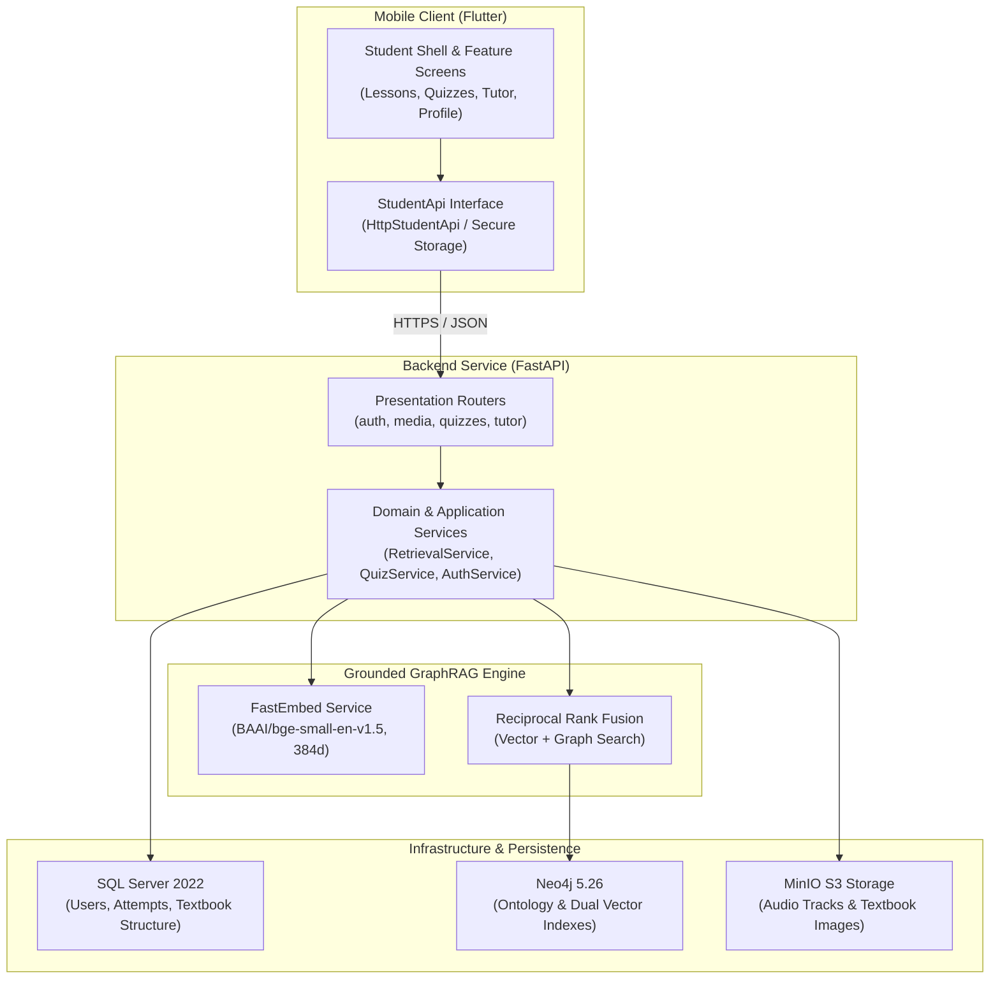

<!--
SPDX-FileCopyrightText: 2026 English 7 Grounded Learning Platform contributors
SPDX-License-Identifier: Apache-2.0
-->

# System Architecture Overview

The **English 7 Grounded Learning Platform** is an educational AI system engineered for Vietnamese Grade 7 English students. It enforces grounded textbook citations, multi-hop pedagogical reasoning, and responsive mobile learning.

## High-Level Architecture Diagram

## Storage Responsibilities

1. **Microsoft SQL Server**:
   - Manages relational entities: user accounts, student profiles, attempts, quiz submissions, and textbook metadata.
   - Enforces foreign key constraints and transactional integrity.

2. **Neo4j Graph Database**:
   - Models curriculum ontology: `Topic`, `GrammarRule`, `Vocabulary`, `PronunciationSound`, and `SourceFragment`.
   - Links nodes with pedagogical relationships (`TEACHES`, `EXPLAINS`, `PRACTICES`, `PREREQUISITE_OF`).
   - Hosts dual vector indexes (`source_fragment_embedding`, `knowledge_concept_embedding`) for hybrid vector + graph traversal.

3. **MinIO Object Storage**:
   - Hosts lesson audio recordings (`.mp3`) and textbook activity illustrations (`.png`, `.jpg`).
   - Serves assets through streaming endpoints with range request support.

## Clean Architecture Guarantees

- Domain models and ontology dataclasses have zero dependencies on web frameworks or databases.
- Repositories encapsulate database drivers; routers only interact through service interfaces.
- AI Tutor answers are verified against grounded retrieved contexts before being returned to the student.
