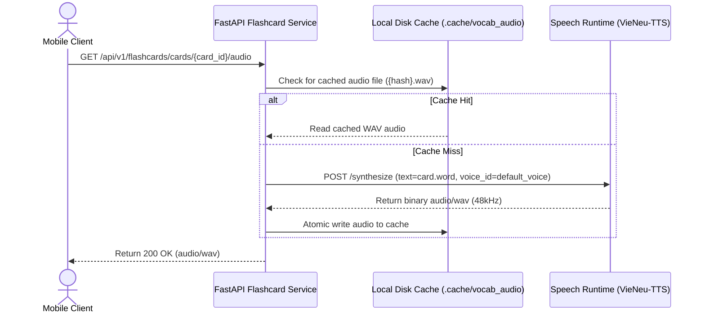

# Flashcard Vocabulary Pronunciation with VieNeu-TTS Design

## 1. Problem Statement
In the current application, the vocabulary flashcards feature (`Flashcard`) and speaking practice feature (`SpeakingScreen`) lack audio pronunciation data for vocabulary words. 
- While `Flashcard` entities have an `audio_url` field, it defaults to `None` for all seeded textbook cards and user-created cards because there is no pre-recorded audio dataset.
- In `SpeakingScreen`, the "Nghe mẫu tiếng Anh" button is currently disabled and replaced with the message: *"Chưa có audio tiếng Anh đã kiểm duyệt cho từ này."*
- In `ReviewScreen` (flashcard review/practice mode), students cannot hear the pronunciation of the word when reviewing cards.

To solve this without requiring expensive commercial cloud TTS or manual audio recording, we utilize the already integrated **VieNeu-TTS** engine (`pnnbao-ump/VieNeu-TTS-v3-Turbo`) running locally in `speech/` to synthesize authentic pronunciation for vocabulary on-demand, coupled with a server-side audio cache.

## 2. Architecture & Data Contracts



### 2.1 Backend Contract & Endpoints
- **Endpoint**: `GET /api/v1/flashcards/cards/{card_id}/audio`
- **Authentication**: `require_student` dependency (role = `student`).
- **Authorization**:
  - The card belongs to a public textbook deck (`kind == 'textbook'`), OR
  - The card belongs to a personal deck owned by the current student (`owner_id == user.id`).
  - Otherwise, return `404 Not Found` or `403 Forbidden`.
- **Response**:
  - Binary WAV audio (`Content-Type: audio/wav`).
  - Headers: `Cache-Control: public, max-age=86400`.

### 2.2 Server-side Audio Cache & VieNeu-TTS Integration
- **Cache Location**: `speech/.cache/vocab_audio/` (configurable via environment variable `VOCAB_AUDIO_CACHE_DIR`).
- **Cache Key**: `hashlib.sha256(f"{normalized_word}:{voice_id}".encode()).hexdigest() + ".wav"`.
- **VieNeu-TTS Invocation**:
  - When cache misses, the backend calls `speech_runtime.synthesize(text=card.word, voice_id=voice_id)`.
  - The default voice is chosen from available preset voices (e.g. `Mai Anh` or system default).
- **Concurrency & Resilience**:
  - File write uses atomic temporary file replacement (`tempfile.NamedTemporaryFile` + `os.replace`) to prevent corrupted cache reads under concurrent student requests.
  - If speech service is unavailable (`503` or timeout), backend returns HTTP `503 Service Unavailable` with `detail: "Speech service unavailable"`.

### 2.3 Mobile App Contract & UI

#### `LearningApi` & `ApiLearning` (`mobile/lib/app/`)
- Add method to `LearningApi`:
  ```dart
  Future<Uint8List> loadCardAudio(String cardId);
  ```
- Implement in `ApiLearning`:
  ```dart
  @override
  Future<Uint8List> loadCardAudio(String cardId) =>
      learningClient.audioBytes('/api/v1/flashcards/cards/$cardId/audio');
  ```

#### Flashcard Review Screen (`mobile/lib/features/flashcards/review_screen.dart`)
- When `_revealed == true` (answer is shown):
  - Add an audio pronunciation icon button `IconButton(icon: Icon(Icons.volume_up))` next to `card.word`.
  - Tapping the icon calls `api.loadCardAudio(card.id)` and plays it via audio player.
  - Display a subtle loading spinner while fetching audio.

#### Speaking Screen (`mobile/lib/features/speaking/speaking_screen.dart`)
- Update "Nghe mẫu tiếng Anh" button:
  - Remove condition `card.audioUrl == null`.
  - Wire button to `_playResponse(widget.api.loadCardAudio(card.id))`.
  - The button is now always available for students to hear sample word pronunciation before speaking.

## 3. Error Handling & Pedagogical Guardrails
- **Non-blocking UI**: If TTS audio fails or speech service is down, Mobile shows a non-intrusive SnackBar: *"Tạm thời chưa phát được âm thanh. Em vẫn có thể tiếp tục học thẻ từ."* The review flow and memory grading remain fully operational.
- **Pedagogical Ontology**: Flashcards retain textbook citations `[Unit X, Page Y]` and curriculum ontology linkage (`vocabulary`).
- **Idempotency**: Repeated requests for the same word do not re-run inference once cached.

## 4. Testing & Verification Plan
- **Backend Tests (`backend/tests/api/test_learning.py` & `backend/tests/modules/flashcards/`)**:
  - Test audio endpoint generates and caches audio on cache miss.
  - Test audio endpoint serves cached file on cache hit without re-synthesizing.
  - Test authorization: personal card of another user returns 404/403.
- **Mobile Tests (`mobile/test/features/learning_flow_test.dart` & `mobile/test/app/api_learning_test.dart`)**:
  - Test `loadCardAudio` contract.
  - Test `ReviewScreen` displays pronunciation speaker button and plays audio on tap.
  - Test `SpeakingScreen` "Nghe mẫu tiếng Anh" triggers `loadCardAudio`.
- **Quality Gates**: Run `make test` and `make analyze` to ensure 0 lint errors and 100% passing tests.
